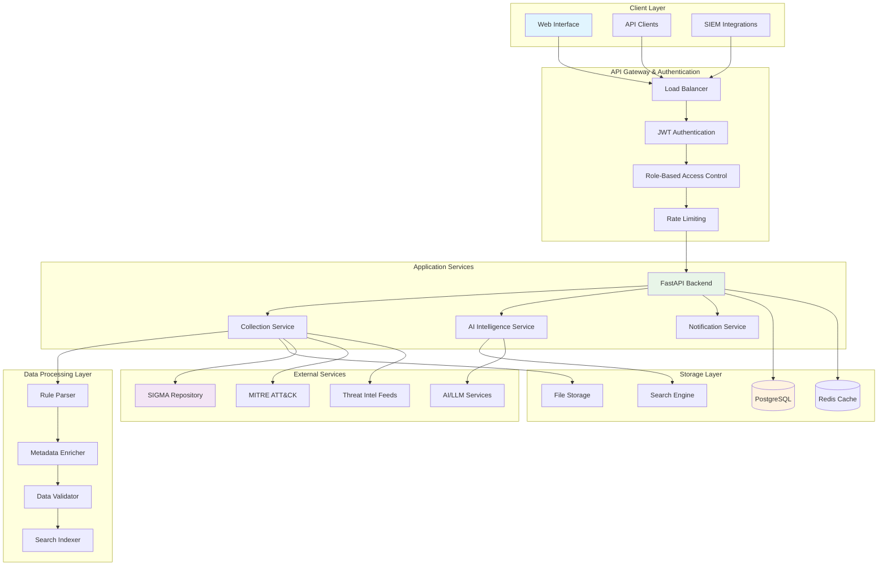
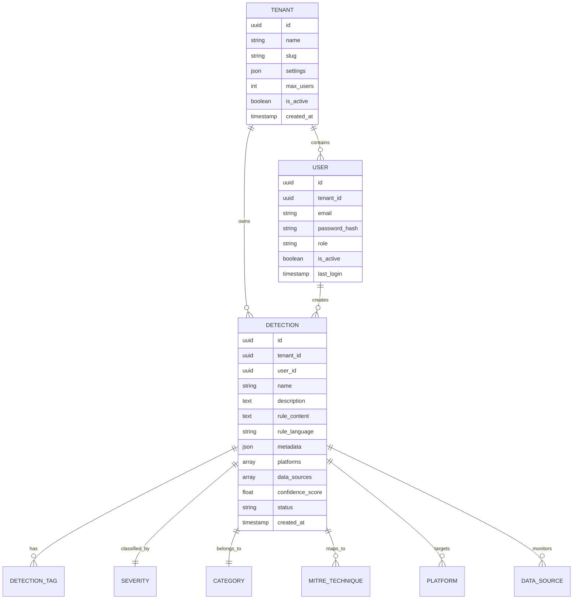
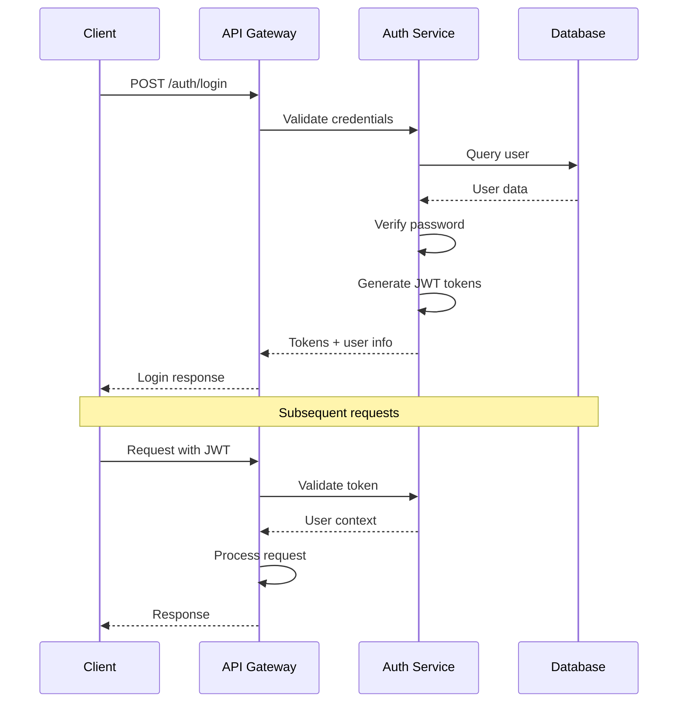
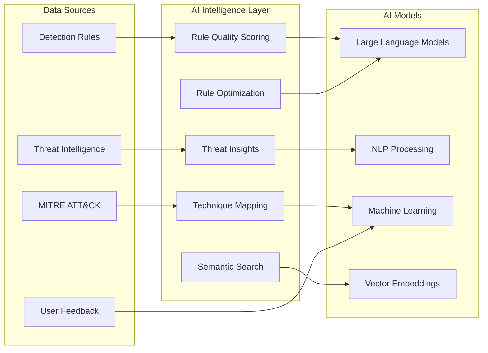
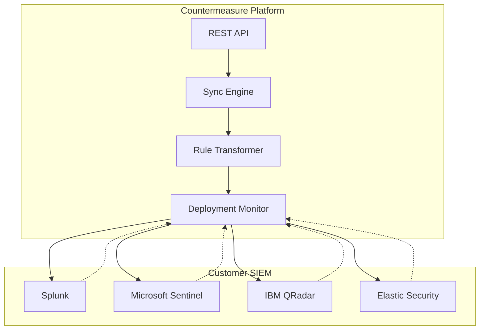

# Countermeasure Platform Architecture

## Platform Overview

Countermeasure is the first enterprise-grade detection intelligence platform that bridges the gap between community knowledge and customer reality, providing AI-powered detection lifecycle management from rule discovery to deployment optimization.

## Core Architecture



## Business Model Architecture

### Free Tier - Community Intelligence

**Target Audience**: Security teams, SOC analysts, researchers, open-source community

**Features**:
- Access to 10,000+ community SIGMA rules
- Basic search and filtering
- MITRE ATT&CK tag viewing
- Export capabilities (JSON, YAML, CSV)
- Community ratings and discussions
- Rate-limited API access (100 requests/hour)

**Revenue Model**: Freemium - drives user acquisition and platform adoption

### Enterprise Tier - Customer Intelligence

**Professional Tier** ($99/user/month):
- Private customer ruleset management
- Rule versioning and change tracking
- Advanced search with custom filters
- Team collaboration features
- Coverage gap analysis
- API access (1000 requests/hour)
- Email support

**Enterprise Tier** ($299/user/month):
- AI-powered rule optimization
- Threat landscape insights and trending
- Custom threat hunting query generation
- SIEM platform integrations
- Advanced analytics and dashboards
- Real-time notifications
- API access (unlimited)
- Priority support

**Enterprise+ Tier** (Custom pricing):
- Dedicated cloud instances
- SSO/SAML authentication
- Custom integrations and connectors
- Professional services and consulting
- SLA guarantees
- Dedicated support team

## Technical Architecture Components

### 1. API Layer (`apps/api/`)

**Technology Stack**:
- **Framework**: FastAPI with async/await
- **Authentication**: JWT with refresh tokens
- **Authorization**: Role-based access control (RBAC)
- **Validation**: Pydantic schemas
- **Documentation**: Auto-generated OpenAPI/Swagger

**Core Modules**:
```
src/
├── api/v1/
│   ├── endpoints/          # Route handlers
│   ├── dependencies/       # Dependency injection
│   └── middleware/         # Custom middleware
├── core/
│   ├── config.py          # Configuration management
│   ├── security.py        # JWT, password hashing
│   ├── logging.py         # Structured logging
│   └── exceptions.py      # Custom exceptions
├── db/
│   ├── models/            # SQLAlchemy models
│   ├── migrations/        # Alembic migrations
│   └── session.py         # Database sessions
└── schemas/               # Pydantic request/response models
```

**Key Design Patterns**:
- **Repository Pattern**: Data access abstraction
- **Service Layer**: Business logic separation
- **Dependency Injection**: Clean architecture
- **Event-Driven**: Async task processing

### 2. Collection Layer (`apps/collector/`)

**Technology Stack**:
- **Framework**: Pure Python with asyncio
- **Task Queue**: Celery with Redis broker
- **HTTP Client**: aiohttp for async requests
- **Parsing**: PyYAML, regex, custom parsers

**Collector Architecture**:
```
src/
├── collectors/
│   ├── base.py           # Base collector interface
│   ├── detection/
│   │   ├── sigma.py      # SIGMA rule collector
│   │   ├── yara.py       # YARA rule collector
│   │   └── snort.py      # Snort rule collector
│   ├── intelligence/
│   │   ├── mitre.py      # MITRE ATT&CK collector
│   │   └── feeds.py      # Threat intel feeds
│   └── validation/
│       ├── syntax.py     # Rule syntax validation
│       └── quality.py    # Rule quality scoring
├── core/
│   ├── api_client.py     # API communication
│   ├── scheduler.py      # Collection scheduling
│   └── monitoring.py     # Health monitoring
└── schemas/              # Data transformation schemas
```

### 3. Data Model Architecture

**Entity Relationship Overview**:


**Key Database Features**:
- **Multi-tenancy**: Row-level security isolation
- **JSONB Fields**: Flexible metadata storage
- **Full-Text Search**: PostgreSQL tsvector indexes
- **Array Types**: Efficient tag and platform storage
- **Audit Trails**: Complete change tracking

### 4. Security Architecture

**Authentication Flow**:


**Security Features**:
- **JWT Authentication**: Stateless token-based auth
- **Refresh Tokens**: Secure token renewal
- **Role-Based Access Control**: Granular permissions
- **Input Validation**: Pydantic schema validation
- **SQL Injection Protection**: SQLAlchemy ORM
- **Rate Limiting**: API abuse prevention
- **Audit Logging**: Complete activity tracking
- **Data Encryption**: At rest and in transit

### 5. AI Intelligence Architecture

**AI Services Integration**:


**AI Capabilities**:
- **Rule Quality Scoring**: Automated rule effectiveness assessment
- **Optimization Suggestions**: AI-powered rule improvements
- **Threat Landscape Analysis**: Pattern recognition in threat data
- **Semantic Search**: Vector-based rule discovery
- **Auto-mapping**: MITRE ATT&CK technique association

### 6. Integration Architecture

**SIEM Integration Pattern**:


**Integration Features**:
- **One-way Sync**: Push rules to SIEM platforms
- **Format Translation**: Convert between rule languages
- **Deployment Tracking**: Monitor rule deployment status
- **Error Handling**: Robust failure recovery
- **Batch Processing**: Efficient bulk operations

## Scalability Architecture

### Horizontal Scaling Strategy

**API Scaling**:
- **Stateless Design**: No server-side sessions
- **Load Balancing**: Multiple API instances
- **Database Connection Pooling**: Efficient resource usage
- **Caching Strategy**: Redis for frequently accessed data

**Collection Scaling**:
- **Worker Pools**: Parallel collection processing
- **Queue-based Architecture**: Async task distribution
- **Rate Limiting**: Respect external API limits
- **Retry Logic**: Robust failure handling

**Database Scaling**:
- **Read Replicas**: Scale read operations
- **Connection Pooling**: Optimize database connections
- **Query Optimization**: Efficient data access patterns
- **Partitioning**: Table partitioning for large datasets

### Performance Targets

**API Performance**:
- **Response Time**: < 200ms (95th percentile)
- **Throughput**: 1000+ requests/second
- **Availability**: 99.9% uptime SLA
- **Concurrent Users**: 10,000+ simultaneous users

**Collection Performance**:
- **Rule Processing**: 1000+ rules/minute
- **Data Freshness**: < 1 hour from source
- **Error Rate**: < 1% failed collections
- **Recovery Time**: < 5 minutes for failed jobs

## Deployment Architecture

### Container Strategy

**Docker Images**:
```dockerfile
# API Service
FROM python:3.11-slim
WORKDIR /app
COPY requirements.txt .
RUN pip install -r requirements.txt
COPY src/ ./src/
CMD ["uvicorn", "src.main:app", "--host", "0.0.0.0"]

# Collector Service
FROM python:3.11-slim
WORKDIR /app
COPY requirements.txt .
RUN pip install -r requirements.txt
COPY src/ ./src/
CMD ["celery", "worker", "-A", "src.main"]
```

**Kubernetes Deployment**:
```yaml
apiVersion: apps/v1
kind: Deployment
metadata:
  name: countermeasure-api
spec:
  replicas: 3
  selector:
    matchLabels:
      app: countermeasure-api
  template:
    metadata:
      labels:
        app: countermeasure-api
    spec:
      containers:
      - name: api
        image: countermeasure/api:latest
        ports:
        - containerPort: 8000
        env:
        - name: DATABASE_URL
          valueFrom:
            secretKeyRef:
              name: db-secret
              key: url
```

### Environment Strategy

**Development**:
- Local Docker Compose
- SQLite for quick setup
- Hot reloading enabled
- Debug logging

**Staging**:
- Kubernetes cluster
- PostgreSQL database
- Production-like data
- Performance testing

**Production**:
- Multi-region deployment
- High-availability PostgreSQL
- Load balancing
- Monitoring and alerting

## Monitoring and Observability

### Metrics Collection

**Application Metrics**:
- Request latency and throughput
- Error rates and types
- Database query performance
- Cache hit rates
- Business metrics (rules processed, users active)

**Infrastructure Metrics**:
- CPU and memory usage
- Disk I/O and storage
- Network bandwidth
- Container health
- Database connections

**Business Metrics**:
- User acquisition and retention
- Feature adoption rates
- API usage patterns
- Revenue metrics
- Customer satisfaction scores

### Logging Strategy

**Structured Logging**:
```json
{
  "timestamp": "2024-01-15T10:30:45Z",
  "level": "INFO",
  "service": "api",
  "correlation_id": "abc123",
  "user_id": "user-456",
  "tenant_id": "tenant-789",
  "action": "detection_created",
  "resource": "detection",
  "success": true,
  "duration_ms": 150,
  "metadata": {
    "detection_id": "det-123",
    "rule_language": "sigma"
  }
}
```

### Alerting Rules

**Critical Alerts**:
- API response time > 1 second
- Error rate > 5%
- Database connection failures
- Service health check failures
- Security events (failed auth, suspicious activity)

**Warning Alerts**:
- High memory usage (>80%)
- Slow database queries (>500ms)
- Collection job failures
- Cache miss rate increase
- User churn alerts

## Security and Compliance

### Data Protection

**Encryption**:
- **At Rest**: AES-256 database encryption
- **In Transit**: TLS 1.3 for all connections
- **Application**: bcrypt for password hashing
- **Secrets**: HashiCorp Vault for key management

**Access Control**:
- **Multi-factor Authentication**: TOTP support
- **SSO Integration**: SAML, OIDC protocols
- **API Keys**: Scoped permissions
- **Audit Trails**: Complete activity logging

### Compliance Framework

**SOC 2 Type II**:
- Security controls documentation
- Regular penetration testing
- Employee security training
- Incident response procedures

**GDPR Compliance**:
- Data minimization principles
- User consent management
- Right to deletion
- Data portability features

**Enterprise Requirements**:
- Role-based access control
- Data retention policies
- Change management processes
- Disaster recovery planning

## Future Architecture Considerations

### Microservices Evolution

**Service Decomposition**:
- Authentication service
- Rule management service
- Collection orchestration service
- Analytics and reporting service
- Integration management service

### Event-Driven Architecture

**Event Streaming**:
- Apache Kafka for event streaming
- Event sourcing for audit trails
- CQRS for read/write separation
- Saga pattern for distributed transactions

### AI/ML Platform Integration

**MLOps Pipeline**:
- Model training and validation
- A/B testing for AI features
- Model versioning and rollback
- Performance monitoring

This architecture provides a solid foundation for scaling Countermeasure from a startup MVP to an enterprise-grade platform serving thousands of customers with millions of detection rules.