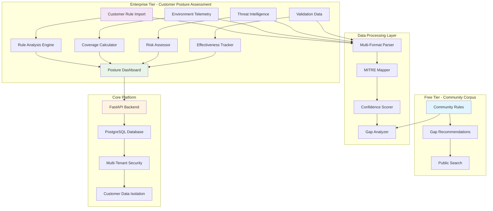

# Countermeasure Platform

>  Enterprise security posture assessment platform that aggregates customer detection rules, threat intelligence, environment telemetry, and validation data to provide comprehensive coverage scoring and threat-specific risk assessment.

[](http://localhost:8000/docs)
[](https://postgresql.org)
[](https://python.org)
[](LICENSE)

## 🎯 Platform Purpose

Countermeasure transforms how security teams assess their defensive posture by providing:

- **Customer Rule Analysis**: Import and analyze detection rules from all SIEM platforms (SIGMA, KQL, Splunk, etc.)
- **Environment Telemetry**: Map deployed security tools and endpoint coverage
- **Threat-Specific Scoring**: "How well am I protected against APT29?" with detailed assessments
- **Coverage Gap Analysis**: MITRE ATT&CK heatmaps showing defensive gaps and recommendations
- **Validation Tracking**: Monitor rule effectiveness and testing results over time
- **Community Corpus**: 10,000+ community rules for gap remediation recommendations

## 🏗️ Architecture Overview



## 🚀 Quick Start

### Prerequisites

- Python 3.11+
- PostgreSQL 12+
- Git

### 1. Start the API Server

```bash
cd apps/api
uv run uvicorn src.main:app --host 0.0.0.0 --port 8000
```

**API Endpoints:**
- API Documentation: http://localhost:8000/docs
- Health Check: http://localhost:8000/health
- Interactive API: http://localhost:8000/redoc

### 2. Initialize Database

```bash
cd apps/api
uv run python -m src.db.init_db
```

**Default Admin Credentials:**
- Email: `admin@countermeasure.dev`
- Password: `CountermeasureAdmin123!`

### 3. Import Community Rules

```bash
# Import 100 SIGMA rules
python scripts/import_sigma_rules.py --limit 100 --password "CountermeasureAdmin123!"

# Or use the collector directly
cd apps/collector
uv run python -m src.collectors.detection.sigma --limit 100
```

## 📁 Project Structure

```
countermeasure/
├── apps/
│   ├── api/                    # FastAPI backend application
│   │   ├── src/
│   │   │   ├── api/           # API route handlers
│   │   │   ├── core/          # Configuration, logging, security
│   │   │   ├── db/            # Database models, sessions, migrations
│   │   │   └── schemas/       # Pydantic schemas
│   │   └── tests/             # API tests
│   └── collector/              # Data collection applications
│       ├── src/
│       │   ├── collectors/    # Collection modules (SIGMA, etc.)
│       │   ├── core/          # API client, configuration
│       │   └── schemas/       # Data schemas
│       └── tests/             # Collector tests
├── scripts/                    # Utility scripts
│   ├── import_sigma_rules.py  # Enterprise SIGMA import utility
│   └── README.md              # Scripts documentation
├── docs/                       # Documentation
│   ├── ARCHITECTURE.md        # Detailed architecture
│   ├── API.md                 # API documentation
│   └── DEPLOYMENT.md          # Deployment guide
└── README.md                  # This file
```

## 🛠️ Development

### Database Management

```bash
# Create migration
cd apps/api
uv run alembic revision --autogenerate -m "description"

# Apply migrations
uv run alembic upgrade head

# Check current version
uv run alembic current
```

### Running Tests

```bash
# API tests
cd apps/api
uv run pytest tests/ -v

# Collector tests
cd apps/collector
uv run pytest tests/ -v

# Run all tests
python -m pytest apps/*/tests/ -v
```

### API Authentication

```bash
# Login to get JWT token
curl -X POST "http://localhost:8000/api/v1/auth/login" \
  -H "Content-Type: application/json" \
  -d '{"email": "admin@countermeasure.dev", "password": "CountermeasureAdmin123!"}'

# Use token for authenticated requests
curl -H "Authorization: Bearer <your-token>" \
  "http://localhost:8000/api/v1/detections/"
```

## 🎨 Business Model

### Free Tier - Community Corpus Only
- Access to 10,000+ community SIGMA rules
- Basic search and filtering
- Export community rules (JSON, YAML)
- Gap recommendation viewing
- Rate-limited API access (100 requests/hour)

### Paid Tier - Security Posture Assessment

**All customer data analysis features require paid subscription:**

**Starter Plan**:
- Customer rule import and analysis (up to 500 rules)
- Basic environment telemetry tracking
- MITRE ATT&CK coverage scoring
- Gap analysis with community recommendations
- Threat-specific risk assessment (up to 5 threat actors)
- Basic posture dashboard

**Professional Plan**:
- Unlimited customer rule analysis
- Advanced environment telemetry and EDR integrations
- Comprehensive threat actor coverage (unlimited)
- Validation data tracking and effectiveness scoring
- AI-powered optimization recommendations
- Advanced analytics and reporting
- API access for integrations

**Enterprise Plan**:
- Multi-tenant customer management
- Dedicated instances and data isolation
- SSO/SAML authentication
- Custom threat intelligence feeds
- Professional services and consulting
- SLA guarantees and priority support

## 🔌 Integrations

### Current
- **SIGMA Repository**: Automated import from SigmaHQ
- **MITRE ATT&CK**: Technique mapping and coverage analysis
- **PostgreSQL**: Enterprise-grade data storage
- **JWT Authentication**: Secure API access

### Planned
- **Splunk**: Direct rule synchronization
- **Microsoft Sentinel**: Cloud SIEM integration
- **IBM QRadar**: Enterprise SIEM connector
- **Elastic Security**: Detection rule management
- **SSO Providers**: SAML, OIDC, Active Directory

## 📊 Key Features

### Customer Data Ingestion
- **Multi-Format Rule Import**: SIGMA, KQL, Splunk SPL, YARA, custom formats
- **Environment Telemetry**: Security tool deployment mapping and coverage metrics
- **Threat Intelligence**: Threat actor profiles, campaigns, and TTPs
- **Validation Data**: Rule testing results and effectiveness tracking
- **Vulnerability Data**: CVE mapping to detection coverage

### Security Posture Assessment
- **Coverage Scoring**: Real-time MITRE ATT&CK technique coverage percentage
- **Threat-Specific Risk**: "How protected am I against APT29?" assessments
- **Gap Analysis**: Identify missing coverage with specific recommendations
- **Confidence Calculation**: AI-powered scoring based on multiple data sources
- **Environment Context**: Adjust scoring based on actual deployment telemetry

### Advanced Analytics
- **Interactive Heatmaps**: MITRE ATT&CK coverage visualization
- **Trend Analysis**: Coverage improvements over time
- **Effectiveness Scoring**: Rule performance in customer environments
- **Compliance Mapping**: NIST, ISO 27001 framework alignment
- **Executive Dashboards**: C-level security posture reporting

### Enterprise Security
- **Customer Data Isolation**: Strict multi-tenant architecture
- **API-First Design**: Comprehensive REST API for integrations
- **Audit Trails**: Complete tracking of all data imports and analysis
- **Role-Based Access**: Granular permissions for team collaboration
- **Data Encryption**: End-to-end security for sensitive customer data

## 🏗️ Development

### Project Structure

```
countermeasure/
├── apps/                    # Application services
│   ├── api/                # FastAPI REST API
│   └── collector/          # Celery collection service
├── packages/               # Shared packages
│   ├── shared-types/       # Common type definitions
│   ├── database/           # Database schemas
│   └── utils/              # Shared utilities
├── infrastructure/         # Infrastructure as Code
│   ├── docker/             # Docker configurations
│   ├── kubernetes/         # K8s manifests
│   └── terraform/          # Terraform modules
└── docs/                   # Documentation
```

### Development Workflow

1. **Create Feature Branch**
   ```bash
   git checkout -b feature/new-feature
   ```

2. **Make Changes**
   ```bash
   # Format code
   make format

   # Run tests
   make test

   # Check security
   make security
   ```

3. **Commit & Push**
   ```bash
   git add .
   git commit -m "feat: add new feature"
   git push origin feature/new-feature
   ```

4. **Create Pull Request**
   - All tests must pass
   - Security scans must be clean
   - Code coverage must meet requirements
   - Documentation must be updated

### Code Quality Standards

- **Type Hints:** All functions must have type annotations
- **Documentation:** All public functions must have docstrings
- **Testing:** New features require comprehensive tests
- **Security:** No secrets in code, security-first design
- **Performance:** Sub-200ms API response times

## 📖 Documentation

### API Documentation

- **Interactive Docs:** http://localhost:8000/docs
- **ReDoc:** http://localhost:8000/redoc
- **OpenAPI Spec:** http://localhost:8000/openapi.json

### Architecture Documentation

- [System Architecture](docs/architecture/system-design.md)
- [Database Schema](docs/architecture/database-schema.md)
- [API Design](docs/api/design-principles.md)
- [Security Model](docs/architecture/security-model.md)

### Deployment Guides

- [Development Setup](docs/deployment/development.md)
- [Production Deployment](docs/deployment/production.md)
- [Kubernetes Guide](docs/deployment/kubernetes.md)

## 🤝 Contributing

We welcome contributions! Please see our [Contributing Guide](CONTRIBUTING.md) for details.

### Development Guidelines
- Follow PEP 8 for Python code style
- Add type hints to all functions
- Write comprehensive tests for new features
- Update documentation for API changes
- Use conventional commit messages

## 🗺️ Roadmap

### Phase 1: Foundation ✅
- Multi-tenant authentication system
- Basic detection CRUD operations
- Community rules import (SIGMA)
- PostgreSQL with migrations

### Phase 2: Customer Intelligence (Q1 2024)
- Private ruleset management
- Rule versioning system
- Team collaboration features
- Advanced search and filtering

### Phase 3: Coverage Analysis (Q2 2024)
- MITRE ATT&CK coverage engine
- Gap analysis and recommendations
- Risk assessment scoring
- Compliance reporting

### Phase 4: AI Intelligence (Q3 2024)
- Rule quality scoring with explanations
- Optimization suggestions
- Threat landscape insights
- Semantic search capabilities

### Phase 5: Enterprise Integrations (Q4 2024)
- SIEM platform connectors
- SSO/SAML authentication
- Advanced monitoring and alerting
- Dedicated instance deployment

## 🐛 Troubleshooting

### Common Issues

**Services won't start:**
```bash
# Check Docker status
docker-compose -f infrastructure/docker/docker-compose.dev.yml ps

# View logs
docker-compose -f infrastructure/docker/docker-compose.dev.yml logs
```

**Database connection errors:**
```bash
# Reset database
docker-compose -f infrastructure/docker/docker-compose.dev.yml down -v
make dev-up
make migrate
```

**Tests failing:**
```bash
# Clean environment
make clean
make setup
make test
```

## 📞 Support

- **Documentation:** [docs/](docs/)
- **Issues:** [GitHub Issues](https://github.com/your-org/countermeasure/issues)
- **Discussions:** [GitHub Discussions](https://github.com/your-org/countermeasure/discussions)

## 📄 License

This project is licensed under the MIT License - see the [LICENSE](LICENSE) file for details.

---

**Built with ❤️ for the cybersecurity community**